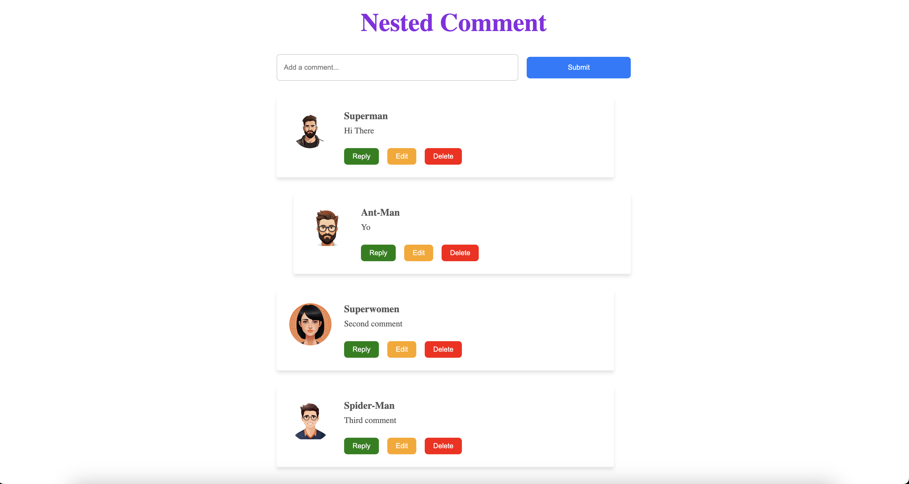

# Nested Comments Feature

This project implements a nested comments feature where users can add, reply, edit, and delete comments. The design is interactive and allows unlimited nested replies for comments.

## Table of Contents
- [Screenshots](#screenshots)
- [Features](#features)
- [Technologies Used](#technologies-used)
- [Project Structure](#project-structure)
- [Getting Started](#getting-started)
- [Usage](#usage)
- [Future Enhancements](#future-enhancements)
- [Credits](#credits)
- [License](#license)

---

## Screenshots

1. **Adding a Comment**
2. **Replying to a Comment**
3. **Editing a Comment**
4. **Deleting a Comment**

---

## Features
- **Add Comments**: Users can add new comments to the list.
- **Reply to Comments**: Users can reply to any comment, creating a nested structure.
- **Edit Comments**: Edit the text of any comment.
- **Delete Comments**: Remove comments and all their replies.
- **Dynamic Rendering**: UI updates dynamically without reloading the page.
- **Responsive Design**: Mobile and desktop-friendly interface.

---

## Technologies Used
- **HTML**: For structuring the page.
- **CSS**: For styling the components.
- **JavaScript**: For dynamic functionalities and interactions.

---

## Project Structure
- `index.html`: Main HTML file for the structure.
- `style.css`: CSS file for styling.
- `script.js`: JavaScript file for interactivity.
- `img/`: Folder containing user avatar images.

---

## Getting Started

### Prerequisites
- A web browser (Google Chrome, Firefox, etc.)
- A code editor (VS Code, Sublime Text, etc.)

### Steps
1. Clone or download this repository.
2. Place the project files in a directory.
3. Open `index.html` in a browser.

---

## Usage
1. **Add a Comment**: 
   - Enter text in the "Add a comment" input field and click `Submit`.
2. **Reply to a Comment**: 
   - Click `Reply` under a comment, type your reply, and click `Submit`.
3. **Edit a Comment**: 
   - Click `Edit`, modify the text, and click `Submit`.
4. **Delete a Comment**: 
   - Click `Delete` to remove the comment and all its replies.

---

## Future Enhancements
- Add **User Authentication** for personalized comments.
- Add a **Like/Dislike Feature** for comments.
- Implement **Backend Support** to save comments persistently.
- Add **Pagination** for long threads of comments.

---

## Credits
- **Developer**: Noel Kujur

---

## License
This project is licensed under the MIT License. See the `LICENSE` file for details.
